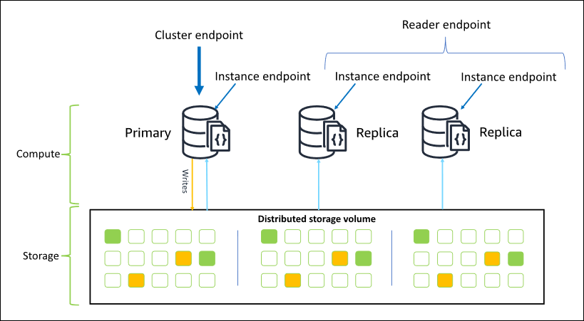

# Getting Started

## AWS DocumentDB Replica Cluster

**Endpoint type**:

1. **Cluster endpoint**: A cluster endpoint is an endpoint for an Amazon DocumentDB cluster that connects to the current
   primary instance for the cluster. Each Amazon DocumentDB cluster has a single cluster endpoint and one primary
   instance. In case of a failover, the cluster endpoint is remapped to the new primary instance.
2. **Reader endpoint**: A reader endpoint is an endpoint for an Amazon DocumentDB cluster that connects to one of the
   available replicas for that cluster. Each Amazon DocumentDB cluster has a reader endpoint. If there is more than one
   replica, the reader endpoint directs each connection request to one of the Amazon DocumentDB replicas.
3. **Instance endpoint**: An instance endpoint is an endpoint that connects to a specific instance. Each instance in a
   cluster, regardless of whether it is a primary or replica instance, has its own unique instance endpoint. It is best
   to not use instance endpoints in your application. This is because they can change roles in case of a failover, thus
   requiring code changes in your application.

### Reference Documentation

* [Amazon DocumentDB Doc](https://docs.aws.amazon.com/documentdb/)
    * [Amazon DocumentDB compatibility with MongoDB](https://docs.aws.amazon.com/documentdb/latest/developerguide/compatibility.html)
    * [Transactions in Amazon DocumentDB](https://docs.aws.amazon.com/documentdb/latest/developerguide/transactions.html)
    * [Best practices for Amazon DocumentDB](https://docs.aws.amazon.com/documentdb/latest/developerguide/best_practices.html)
    * [Developing with Amazon DocumentDB](https://docs.aws.amazon.com/documentdb/latest/developerguide/documentdb-development.html)
    * [Understanding Amazon DocumentDB endpoints](https://docs.aws.amazon.com/documentdb/latest/developerguide/endpoints.html)
* [MongoDB Connection Strings](https://www.mongodb.com/docs/manual/reference/connection-string/)
* [MongoDB Cluster Monitoring](https://www.mongodb.com/docs/drivers/node/current/fundamentals/monitoring/cluster-monitoring/)
* [Accessing Data with MongoDB](https://spring.io/guides/gs/accessing-data-mongodb/)
* [Spring Data MongoDB](https://docs.spring.io/spring-boot/docs/3.3.3/reference/htmlsingle/index.html#data.nosql.mongodb)
* [Connect using the Amazon DocumentDB JDBC driver](https://docs.aws.amazon.com/documentdb/latest/developerguide/connect-jdbc.html)